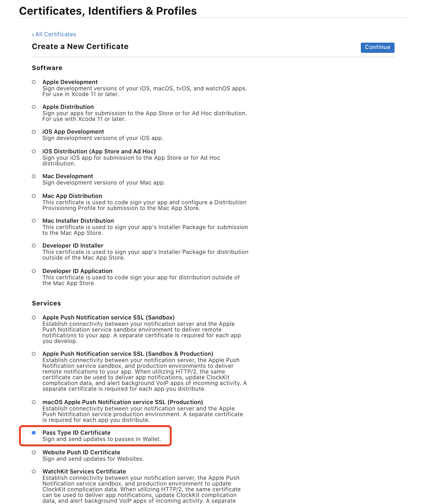
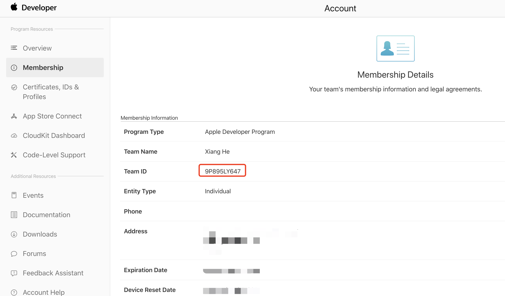

[](https://github.com/HsiangHo/WWDC-Ticket-Pass)
[](https://github.com/HsiangHo/WWDC-Ticket-Pass)

### Design and generate your own WWDC20 ticket pass and add it to your wallet.


## Demo

I've generated a demo pkpass file (Demo.pkpass) and you can Airdrop it to your iPhone, it will be directly added to Wallet.

## Requirements

- Paid Apple Developer Account (To sign your pkpass file)
- Pass Type Identifier and Certificate
- Team Identifier

#### How to request Pass Type Identifier and Certificate  
  

#### How to get Team Identifier  


## Generate Pass
#### Using Generator (macOS 10.15+)


#### Manual
Re-edit the json file in Demo.pass folder  
  
Sign to generate pkpass file using signpass  
```
./signpass -p ./Demo.pass
```


## Airdrop to Wallet


