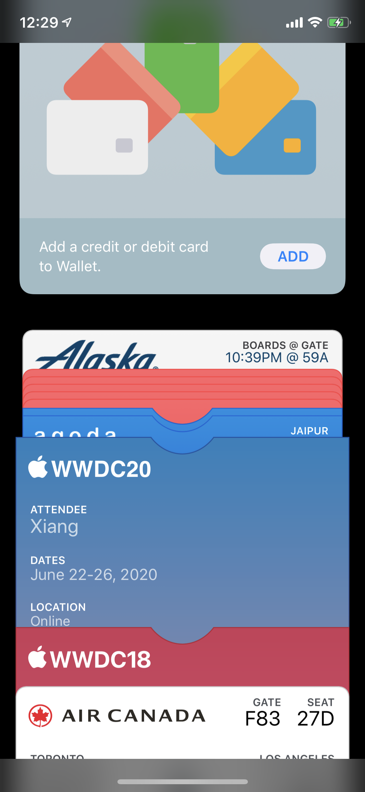
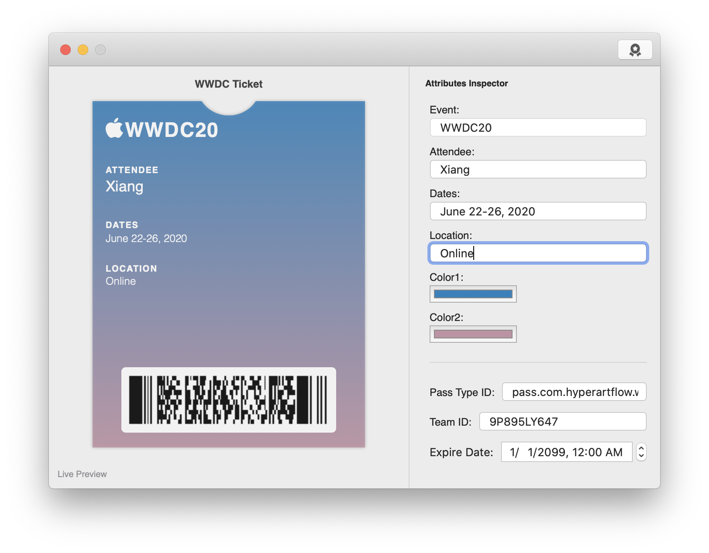
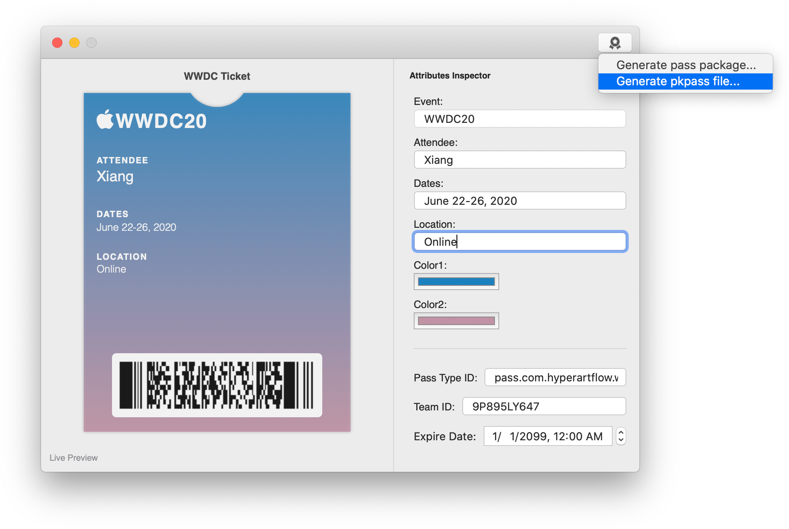
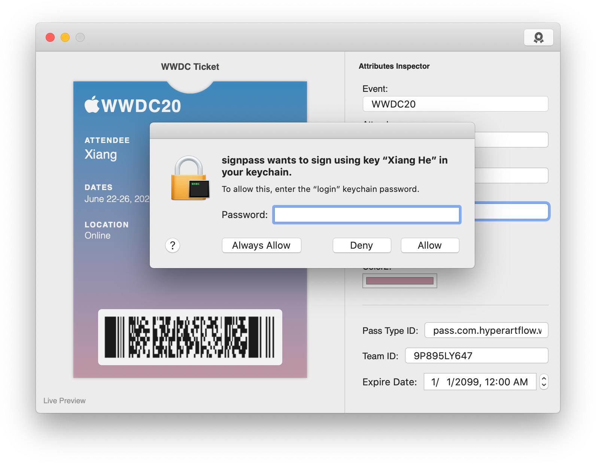
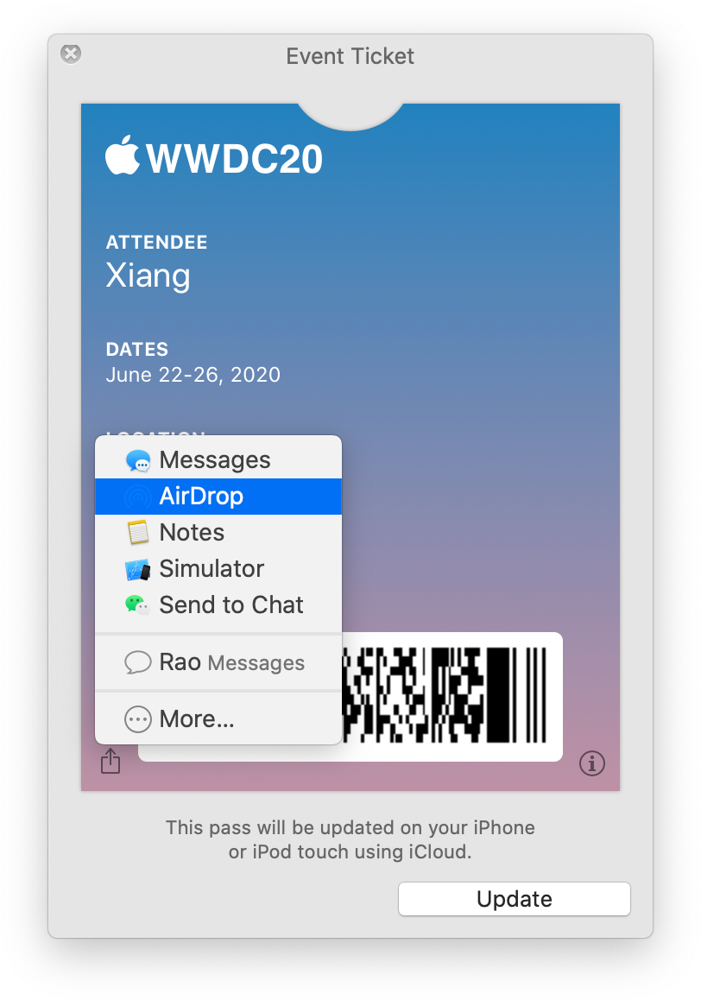
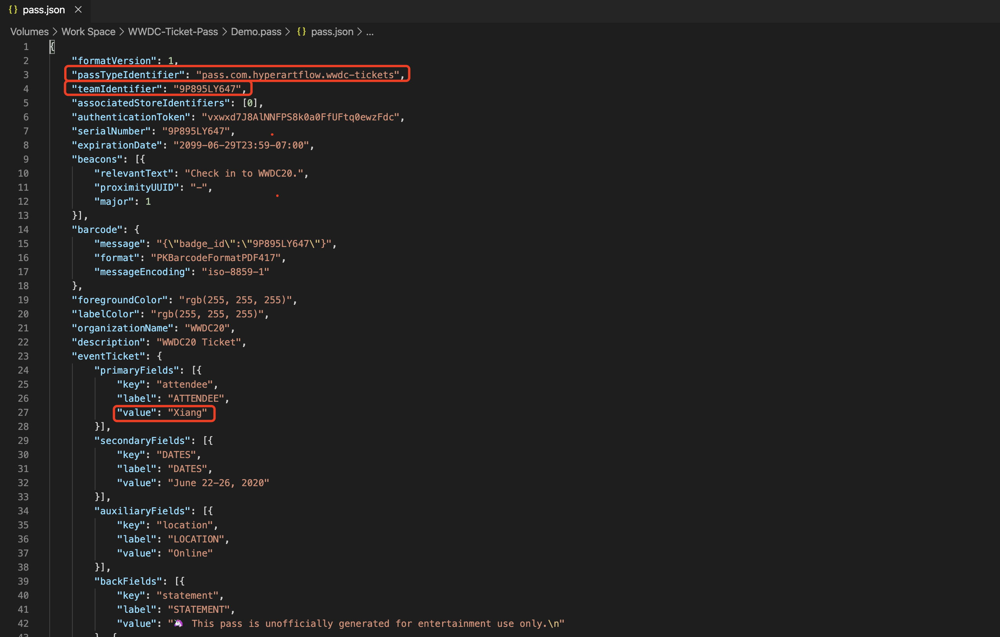
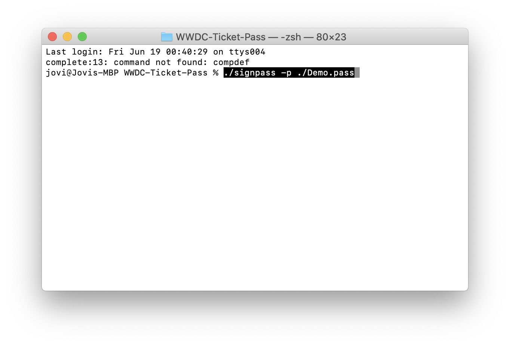

### Design and generate your own WWDC20 ticket pass and add it to your wallet.

## Demo

I've generated a demo pkpass file (Demo.pkpass) and you can airdrop it to your iPhone, it will be directly added to the wallet.

## Requirements

- Paid Apple Developer Account
- Pass Type Identifier
- Team Identifier

## Generator

## Manual

